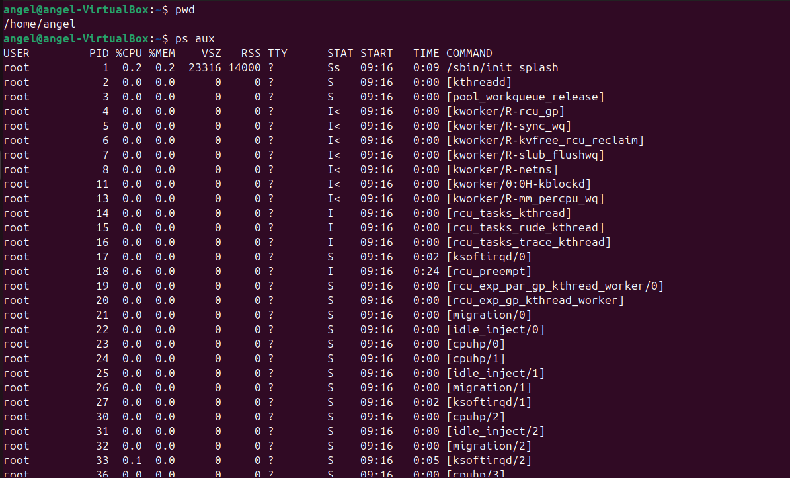
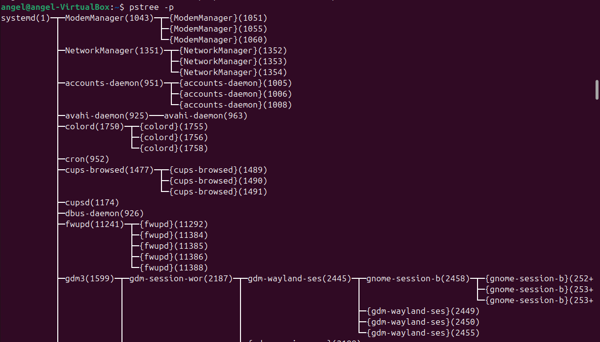
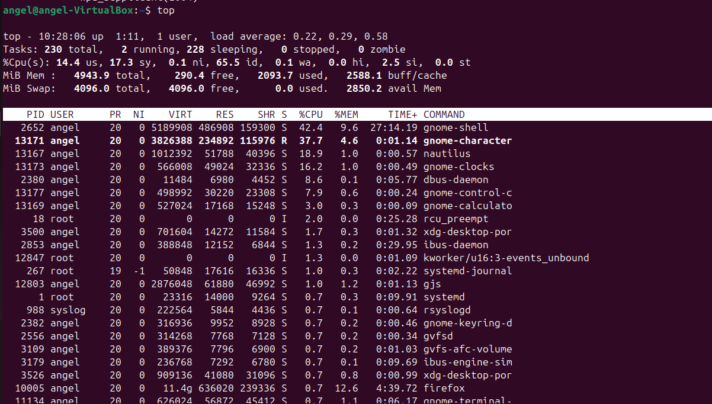

# Linux Process Management Commands

This document explains useful Linux commands for monitoring and managing processes, with examples and outputs.

---

## 🌐 1. View All Processes
### Command:
```bash
ps aux
```
- **a** → show processes for all users  
- **u** → show user/owner of process  
- **x** → show processes not attached to a terminal  

**Example Output:**

---

## 🌲 2. Process Tree
### Command:
```bash
pstree -p
```
Shows parent-child relationships.

**Example Output:**
```
systemd(1)─┬─NetworkManager(778)
           ├─sshd(895)─┬─sshd(1023)───bash(1024)───pstree(1101)
           ├─mysqld(2001)
           └─python3(1234)
```

---

## 📊 3. Real-Time Monitoring
### Command:
```bash
top
```
Displays live system resource usage.



**Example Output:**
```
top - 10:20:51 up 2 days, 3:12, 2 users, load average: 0.22, 0.33, 0.45
Tasks: 197 total, 1 running, 196 sleeping, 0 stopped, 0 zombie
%Cpu(s): 12.3 us, 5.4 sy, 0.0 ni, 80.1 id, 2.2 wa, 0.0 hi, 0.0 si, 0.0 st
KiB Mem : 8045632 total, 3564980 free, 1876324 used, 2604328 buff/cache

PID  USER   PR  NI  VIRT   RES  SHR S %CPU %MEM TIME+    COMMAND
1234 vibhu  20   0 274532 15632 7892 R 45.0 1.5  0:12.34 python3
2001 mysql  20   0 450000 20988 7564 S 25.0 2.0  1:02.11 mysqld
```
👉 Press **q** to quit.

---

## ⚡ 4. Adjust Process Priority
Start process with low priority:
```bash
nice -n 10 sleep 300 &
```
Output:
```
[1] 13749
```
👉 Process with PID **13749** runs with nice value 10.


Change priority:
```bash
renice -n -5 -p 13749
```
Output:
```
13749 (process ID) old priority 10, new priority -5
```

---

## 🔧 5. CPU Affinity
Show which CPUs process can use:
```bash
taskset -cp 3050
```
Output:
```
pid 3050's current affinity list: 0-3
```

Restrict to core 1:
```bash
taskset -cp 1 3050
```
Output:
```
pid 3050's current affinity list: 1
```


---


## 📂 6. I/O Scheduling Priority
```bash
ionice -c 3 -p 3050
```
Output:
```
successfully set pid 3050's IO scheduling class to idle
```
👉 Class 3 = only gets I/O when system is idle.

---

