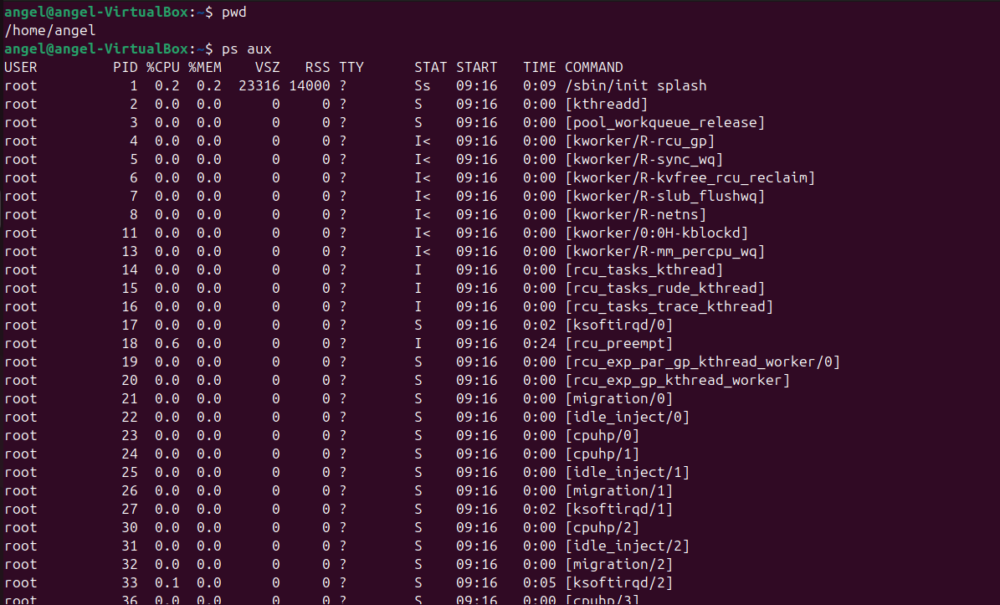
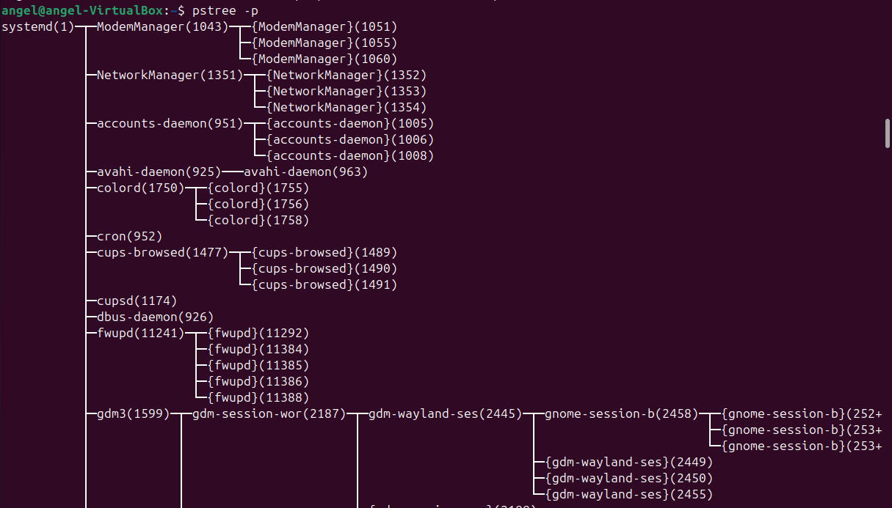
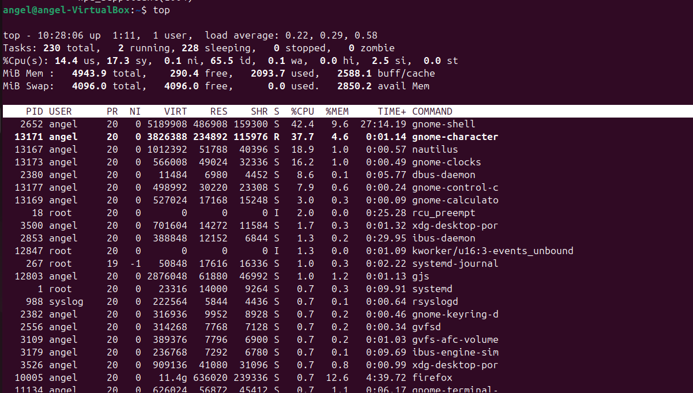

# Linux Process Management Commands

This document explains useful Linux commands for monitoring and managing processes, with examples and outputs.

---

## 🌐 1. View All Processes
### Command:
```bash
ps aux
```
- **a** → show processes for all users  
- **u** → show user/owner of process  
- **x** → show processes not attached to a terminal  

**Example Output:**

---

## 🌲 2. Process Tree
### Command:
```bash
pstree -p
```
Shows parent-child relationships.

**Example Output:**
```
systemd(1)─┬─NetworkManager(778)
           ├─sshd(895)─┬─sshd(1023)───bash(1024)───pstree(1101)
           ├─mysqld(2001)
           └─python3(1234)
```

---

## 📊 3. Real-Time Monitoring
### Command:
```bash
top
```
Displays live system resource usage.



**Example Output:**
```
top - 10:20:51 up 2 days, 3:12, 2 users, load average: 0.22, 0.33, 0.45
Tasks: 197 total, 1 running, 196 sleeping, 0 stopped, 0 zombie
%Cpu(s): 12.3 us, 5.4 sy, 0.0 ni, 80.1 id, 2.2 wa, 0.0 hi, 0.0 si, 0.0 st
KiB Mem : 8045632 total, 3564980 free, 1876324 used, 2604328 buff/cache

PID  USER   PR  NI  VIRT   RES  SHR S %CPU %MEM TIME+    COMMAND
1234 vibhu  20   0 274532 15632 7892 R 45.0 1.5  0:12.34 python3
2001 mysql  20   0 450000 20988 7564 S 25.0 2.0  1:02.11 mysqld
```
👉 Press **q** to quit.

---

## ⚡ 4. Adjust Process Priority
Start process with low priority:
```bash
nice -n 10 sleep 300 &
```
Output:
```
[1] 13749
```
👉 Process with PID **13749** runs with nice value 10.


Change priority:
```bash
renice -n -5 -p 13749
```
Output:
```
13749 (process ID) old priority 10, new priority -5
```

---

## 🔧 5. CPU Affinity
Show which CPUs process can use:
```bash
taskset -cp 3050
```
Output:
```
pid 3050's current affinity list: 0-3
```

Restrict to core 1:
```bash
taskset -cp 1 3050
```
Output:
```
pid 3050's current affinity list: 1
```


---


## 📂 6. I/O Scheduling Priority
```bash
ionice -c 3 -p 3050
```
Output:
```
successfully set pid 3050's IO scheduling class to idle
```
👉 Class 3 = only gets I/O when system is idle.

---

## 📑 7. File Descriptors Used by a Process
Command:
lsof -p 3050 | head -5

**Example Output:**
```bash
COMMAND  PID USER   FD   TYPE DEVICE SIZE/OFF   NODE NAME
sleep   3050 angel  cwd  DIR  253,0     4096  131073 /home/angel
sleep   3050 angel  rtd  DIR  253,0     4096       2 /
sleep   3050 angel  txt  REG  253,0    17520  133580 /usr/bin/sleep
```

## 🐛 8. Trace System Calls of a Process
Command:
strace -p 3050

**Example Output:**
```bash
strace: Process 3050 attached
restart_syscall(<... resuming interrupted nanosleep ...>) = 0
nanosleep({tv_sec=300, tv_nsec=0}, 0x7ffd4a60d8b0) = ? ERESTART_RESTARTBLOCK (Interrupted by signal)
```
👉 Great for debugging system calls and process behavior.

## 📡 9. Find Process Using a Port
Command:
sudo fuser -n tcp 8080
```bash
Output:

8080/tcp:           4321
👉 Process PID 4321 is using port 8080.
``` 

## 📊 10. Per-Process Statistics
Command:
pidstat -p 3050 2 3

**Example Output:**
```bash
Linux 5.15.0 (ubuntu)   09/25/25        _x86_64_        (4 CPU)
12:30:20      UID       PID    %usr %system  %CPU   CPU  Command
12:30:22     1000      3050    0.00    0.00   0.00     1  sleep
12:30:24     1000      3050    0.00    0.00   0.00     1  sleep
12:30:26     1000      3050    0.00    0.00   0.00     1  sleep
```
👉 Displays CPU usage every 2 seconds, 3 times.


## 🔐 11. Control Groups (cgroups) for Resource Limits
```
Create a New cgroup:
sudo cgcreate -g cpu,memory:/testgroup
Limit CPU and Memory:
echo 50000 | sudo tee /sys/fs/cgroup/cpu/testgroup/cpu.cfs_quota_us
echo 100M   | sudo tee /sys/fs/cgroup/memory/testgroup/memory.limit_in_bytes
Add Process (PID 3050) to cgroup:
echo 3050 | sudo tee /sys/fs/cgroup/cpu/testgroup/cgroup.procs
```

## 🎯 12. Alternatives to nice / renice

1. chrt (Real-Time Scheduling)
Set real-time scheduling policies (FIFO or Round Robin).

sudo chrt -f 50 sleep 1000
chrt -p <pid>
2. ionice (I/O Priority Control)
ionice -c 2 -n 7 tar -czf backup.tar.gz /home
3. taskset (CPU Affinity)
taskset -c 1 firefox
4. Control Groups (cgroups)
sudo cgcreate -g cpu,memory:/lowprio
echo 20000 | sudo tee /sys/fs/cgroup/cpu/lowprio/cpu.cfs_quota_us
echo 200M   | sudo tee /sys/fs/cgroup/memory/lowprio/memory.limit_in_bytes
echo 1234 | sudo tee /sys/fs/cgroup/cpu/lowprio/cgroup.procs
5. systemd-run
systemd-run --scope -p CPUWeight=200 stress --cpu 4
6. schedtool
sudo schedtool -R -p 10 <pid>

### ✅ Summary Table
Tool	Focus	Alternative to
chrt	Real-time scheduling policies	nice
ionice	I/O priority control	(complementary)
taskset	CPU affinity control	(complementary)
cgroups	Fine-grained resource management	nice (more powerful)
systemd-run	systemd + cgroups resource mgmt	nice
schedtool	Custom scheduling policies	nice
