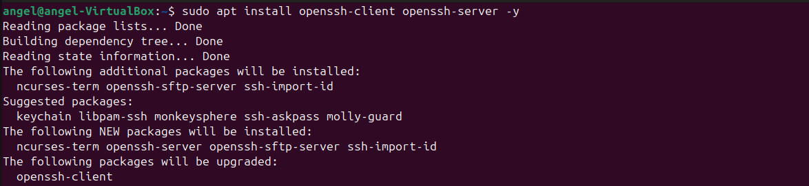
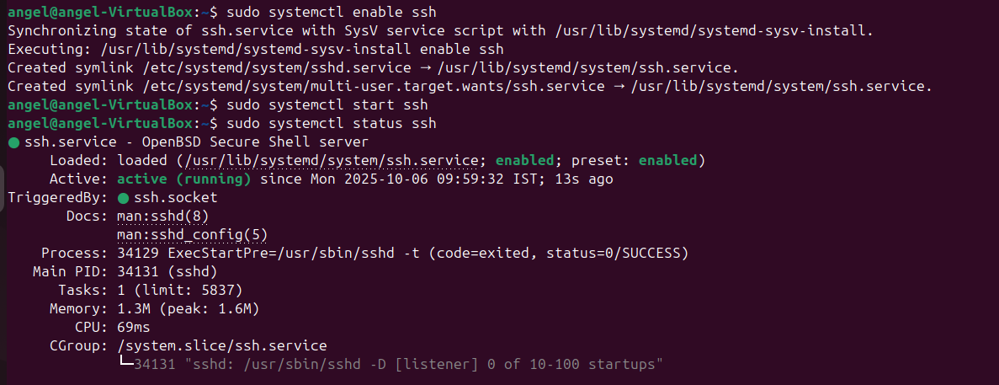
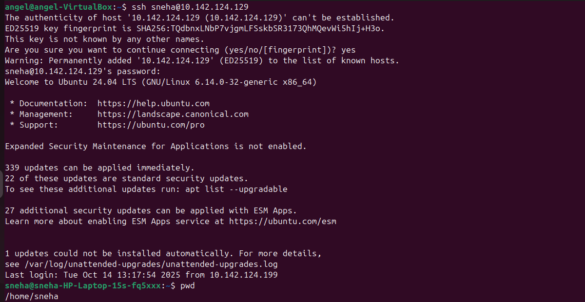
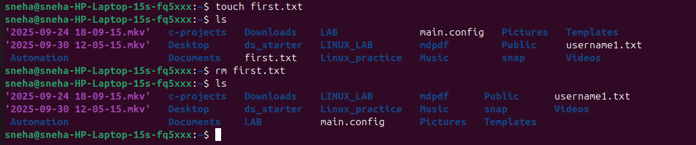
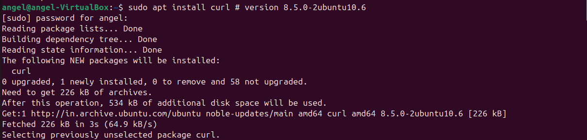
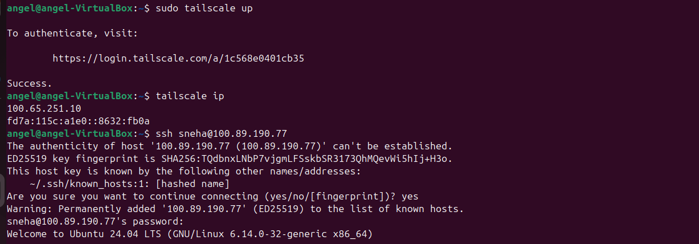

# Technical Document: Understanding SSH (Secure Shell) 🔐

## Introduction

Secure Shell, commonly known as **SSH**, is a powerful cryptographic network protocol that provides a secure way to access computers over an unsecured network such as the internet. It is widely used by system administrators and developers to manage remote servers securely.

---

## What is SSH? 🤔

SSH allows you to connect securely to a remote computer and control it as if you were physically present. It encrypts all the data transmitted between your device (client) and the remote device (server), ensuring privacy and protection against unauthorized access.

### Key Functions of SSH:
- **Remote Login:** Access and manage a remote system securely.
- **Command Execution:** Run commands on the remote machine from your local device.
- **Secure File Transfer:** Transfer files safely using SCP or SFTP.
- **Port Forwarding:** Create encrypted tunnels for other network protocols.

---

## How SSH Works 🔧

SSH operates using a **client-server architecture**:

1. **Connection:** The SSH client initiates a connection to the SSH server over the network, typically on port 22.
2. **Encryption & Key Exchange:** The client and server perform a handshake to exchange cryptographic keys securely.
3. **Authentication:** The server verifies the identity of the client. This can be done by:
   - **Password Authentication:** Simple but less secure.
   - **Public Key Authentication:** More secure, uses cryptographic keys.
4. **Secure Communication:** After authentication, all data is encrypted using symmetric encryption, ensuring confidentiality and integrity.

---

## SSH Protocol Versions

- **SSH-1:** The first version of SSH, now obsolete and insecure.
- **SSH-2:** Current, secure version with stronger encryption and better features.

---

## Installing SSH on Ubuntu 🐧

Ubuntu makes it easy to install both SSH client and server software via the terminal.

### Step 1: Update your package list

```bash
sudo apt update
```

### Step 2: Install SSH Client

Usually installed by default, but to be sure:

```bash
sudo apt install openssh-client
```

### Output Image of the Commands :


## Why Do We Need an Open SSH Client?

An **SSH client** is the tool on your computer that lets you securely connect to and control a remote machine over the network.

### Key reasons we need it:

- **Secure remote access:** Connect safely to servers with encrypted communication.  
- **Run remote commands:** Manage servers as if you are physically present.  
- **File transfer:** Copy files securely using `scp` or `sftp`.  
- **Port forwarding:** Create secure tunnels to access services behind firewalls.  
- **Automation:** Run remote tasks via scripts without manual login.

The **OpenSSH Client** is a popular, open-source SSH tool available on most Linux/Unix systems, ensuring secure and compatible connections.

---

Without an SSH client, you cannot start a secure remote session, making it essential for remote administration and secure communication.


## Checking SSH Server Status 🔍

After installing the SSH server on Ubuntu, it is important to verify whether the SSH service is running properly.

### Check the status of the SSH service

Use the following command to check if the SSH server is active and running:

```bash
sudo systemctl status ssh
```
### Output Image of the Commands :



## Accessing Someone Else's Account on an Ubuntu Server (SSH) 🔐

> This document describes how to access another user's account on an Ubuntu server *after* the SSH server is installed and running (you said you already reached the "status" step). It covers both remote SSH login to that user's account and switching users locally/remotely. Replace placeholders (e.g. `USERNAME`, `SERVER_IP`, `USER_PUBLIC_KEY`) with real values.

---

## Safety & Permissions (Important)

- Only access accounts you are authorized to access. Unauthorized access is illegal and unethical.
- Prefer **key-based authentication** over passwords.
- Avoid sharing private keys or passwords insecurely.

---

## Quick summary of available access methods

1. **Direct SSH login as that user** (recommended when user account exists and SSH keys/passwords are set):  
   `ssh USERNAME@SERVER_IP`

2. **SSH in as a different user, then switch to that user** (requires sudo privileges):  
   - `ssh admin@SERVER_IP`  
   - `sudo su - USERNAME`  or `sudo -i -u USERNAME`

3. **Key-based setup if keys are not yet present** (server-side or client-side options).

4. **Using `ssh-copy-id` from client** to install a public key into the target user’s `~/.ssh/authorized_keys`.

---

## 1 — Direct SSH login (client-side)

If the target user account (`USERNAME`) already has a password or public key set up, the user (or you acting as them) connects directly:

```bash
# password-based (if enabled)
ssh USERNAME@SERVER_IP

# key-based (recommended)
ssh USERNAME@SERVER_IP
``` 

### Output Image of the Commands :




## Creating, Using, and Removing a File on a Remote SSH Account 📝

This guide explains how to create a file on the remote server after SSH login, perform your tasks on it, and then delete it safely.

---

### Step 1: SSH into the remote user's account

```bash
ssh USERNAME@SERVER_IP
```

### Step 2: Create a new file

You can create a new file using several methods:

**Method A**: Using touch (creates an empty file)
```bash
touch myfile.txt
```

### step 3:Remove the file when done

Once your work is complete and you no longer need the file, delete it to clean up:
```bash
rm myfile.txt
```

### Output Image of the Commands :


## Using `curl` and Tailscale on Ubuntu Terminal 🚀

---

### 1. Installing `curl` on Ubuntu

`curl` is a command-line tool for transferring data using URLs. It is widely used to test APIs, download files, and interact with web services.

To install `curl` on Ubuntu, run:

```bash
sudo apt update
sudo apt install curl -y
```
### Output Image of the Commands :


### 2. What is Tailscale?

**Tailscale is a zero-config VPN that securely connects your devices using WireGuard. It creates a private network over the internet, allowing easy, secure access to your devices from anywhere without complex VPN setups.**

### 3. Starting Tailscale on Ubuntu

After installing Tailscale, you can bring up the network interface and authenticate your device using:

```bash
sudo tailscale up
```

### Output Image of the Commands :


#### 4. SSH to the remote account using the Tailscale IP

Once you have the Tailscale IP (e.g. 100.101.102.103), connect with SSH as you normally would:
```bash
sudo tailscale ip
```
