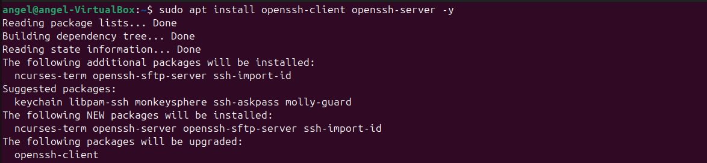
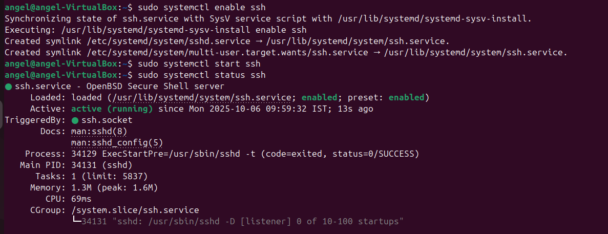
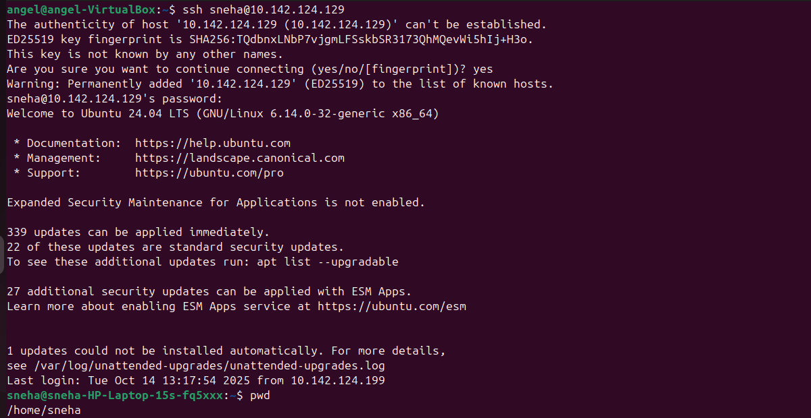
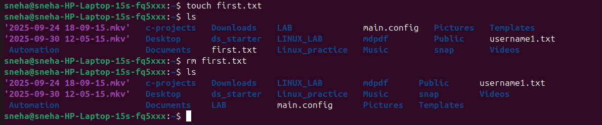
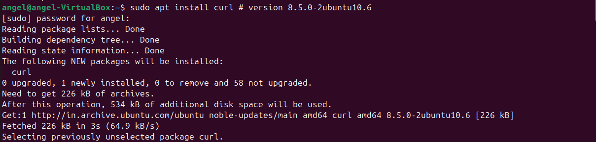
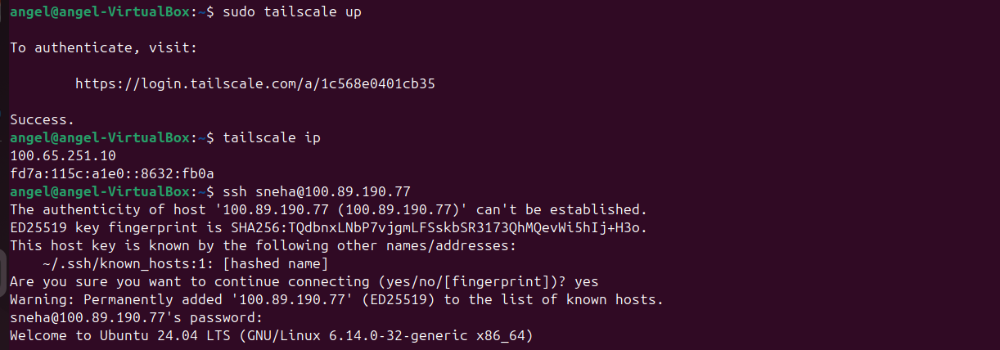

# EXPERIMENT-SSH (Secure Shell) 🔐

## Introduction

Secure Shell, commonly known as **SSH**, is a powerful cryptographic network protocol that provides a secure way to access computers over an unsecured network such as the internet. It is widely used by system administrators and developers to manage remote servers securely.

---

## Installing SSH on Ubuntu 🐧

Ubuntu makes it easy to install both SSH client and server software via the terminal.

### Step 1: Update your package list

```bash
sudo apt update
```

### Step 2: Install SSH Client

Usually installed by default, but to be sure:

```bash
sudo apt install openssh-client
```

### Output Image of the Commands :



## Checking SSH Server Status 🔍

After installing the SSH server on Ubuntu, it is important to verify whether the SSH service is running properly.

### Check the status of the SSH service

Use the following command to check if the SSH server is active and running:

```bash
sudo systemctl status ssh
```
### Output Image of the Commands :



## Accessing Someone Else's Account on an Ubuntu Server (SSH) 🔐

> This document describes how to access another user's account on an Ubuntu server *after* the SSH server is installed and running (you said you already reached the "status" step). It covers both remote SSH login to that user's account and switching users locally/remotely. Replace placeholders (e.g. `USERNAME`, `SERVER_IP`, `USER_PUBLIC_KEY`) with real values.

---

## Safety & Permissions (Important)

- Only access accounts you are authorized to access. Unauthorized access is illegal and unethical.
- Prefer **key-based authentication** over passwords.
- Avoid sharing private keys or passwords insecurely.

---

## Quick summary of available access methods

1. **Direct SSH login as that user** (recommended when user account exists and SSH keys/passwords are set):  
   `ssh USERNAME@SERVER_IP`

2. **SSH in as a different user, then switch to that user** (requires sudo privileges):  
   - `ssh admin@SERVER_IP`  
   - `sudo su - USERNAME`  or `sudo -i -u USERNAME`

3. **Key-based setup if keys are not yet present** (server-side or client-side options).

4. **Using `ssh-copy-id` from client** to install a public key into the target user’s `~/.ssh/authorized_keys`.

---

## 1 — Direct SSH login (client-side)

If the target user account (`USERNAME`) already has a password or public key set up, the user (or you acting as them) connects directly:

```bash
# password-based (if enabled)
ssh USERNAME@SERVER_IP

# key-based (recommended)
ssh USERNAME@SERVER_IP
``` 

### Output Image of the Commands :




## Creating, Using, and Removing a File on a Remote SSH Account 📝

This guide explains how to create a file on the remote server after SSH login, perform your tasks on it, and then delete it safely.

---

### Step 1: SSH into the remote user's account

```bash
ssh USERNAME@SERVER_IP
```

### Step 2: Create a new file

You can create a new file using several methods:

**Method A**: Using touch (creates an empty file)
```bash
touch myfile.txt
```

### step 3:Remove the file when done

Once your work is complete and you no longer need the file, delete it to clean up:
```bash
rm myfile.txt
```

### Output Image of the Commands :


## Using `curl` and Tailscale on Ubuntu Terminal 🚀

---

### 1. Installing `curl` on Ubuntu

`curl` is a command-line tool for transferring data using URLs. It is widely used to test APIs, download files, and interact with web services.

To install `curl` on Ubuntu, run:

```bash
sudo apt update
sudo apt install curl -y
```
### Output Image of the Commands :



### 2. Starting Tailscale on Ubuntu

After installing Tailscale, you can bring up the network interface and authenticate your device using:

```bash
sudo tailscale up
```

### Output Image of the Commands :


#### 4. SSH to the remote account using the Tailscale IP

Once you have the Tailscale IP (e.g. 100.101.102.103), connect with SSH as you normally would:
```bash
sudo tailscale ip
```
